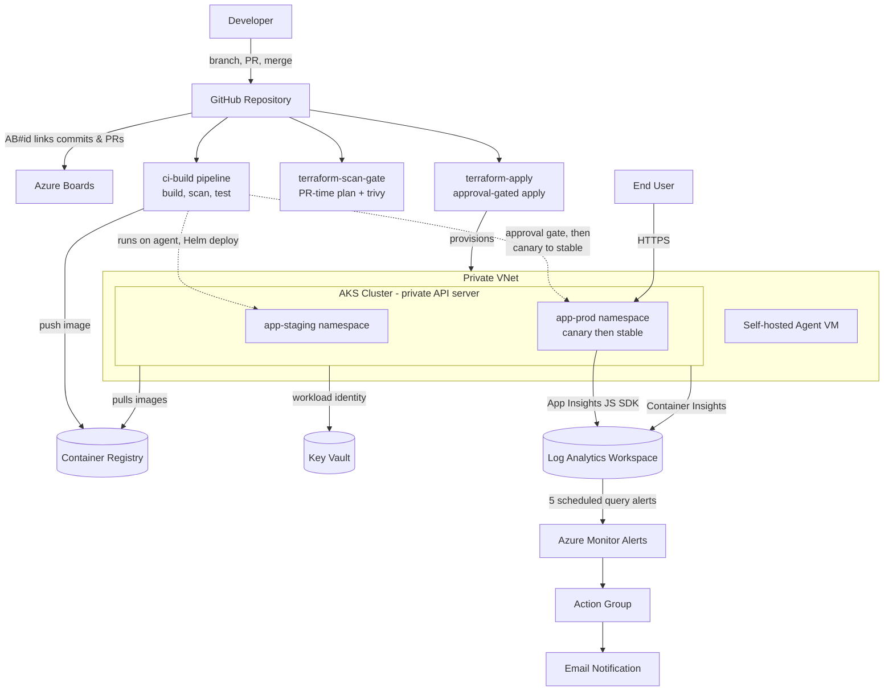

# Azure DevOps Build

An end-to-end Azure DevOps / AZ-400 study project: a static site built, scanned, deployed, monitored, and tracked
through a real trunk-based CI/CD pipeline on Azure — from a bare Terraform state backend up to production alerting
and a DORA deployment-frequency dashboard.

## Architecture



Both the CI/CD pipeline and the Terraform pipelines run their Azure-facing jobs on the self-hosted agent VM inside
the private VNet, since the AKS API server and Key Vault are both locked down to private/known-IP access only.

## What this project demonstrates

Everything here was built and broken and fixed for real: genuine Terraform errors, genuine pipeline failures,
genuine Azure API quirks. It maps loosely across all four AZ-400 exam domains (design and implement processes,
CI, CD, and dependency/security management) — see [`docs/az400-domain-mapping.md`](docs/az400-domain-mapping.md)
for the detailed breakdown.

## Build phases

| Phase | Focus | Status |
|---|---|---|
| 01 | Repo setup, branching strategy, PR workflow | Done |
| 02 | Terraform foundations: state backend, networking, ACR, Key Vault, Log Analytics | Done |
| 03 | AKS via Terraform: cluster, Azure AD RBAC, workload identity | Done |
| 04 | CI pipeline: Docker build, Trivy scan, quality checks, Lighthouse | Done |
| 05 | CD pipeline: Helm deploy, staging/prod promotion, canary releases | Done |
| 06 | Security & compliance: Dependabot, Defender for Cloud, Terraform scan gate | Done |
| 07 | Monitoring & instrumentation: App Insights, Log Analytics, alerting | Done |
| 08 | Process & polish: traceability, DORA metrics, this README, exam mapping | In progress |

## Key design decisions

Full write-ups live in [`docs/decisions/`](docs/decisions/). Highlights:

| ADR | Decision |
|---|---|
| [0002](docs/decisions/0002-trunk-based-branching.md) | Trunk-based development: protected `main`, short-lived branches, PR-gated merges |
| [0006](docs/decisions/0006-azure-cni-networking-for-aks.md) | Azure CNI networking for AKS, with an explicit non-overlapping service CIDR |
| [0007](docs/decisions/0007-azure-rback-for-kubernetes-authorization.md) | Azure AD RBAC for Kubernetes authorization instead of local admin / raw RoleBindings |
| [0008](docs/decisions/0008-single-pipeline-for-ci-and-cd.md) | One combined pipeline (`ci-build`) for CI and CD instead of separate build/release pipelines |
| [0009](docs/decisions/0009-shared-cluster-namespace-environments.md) | Single shared AKS cluster with namespace-per-environment (`app-staging` / `app-prod`) |
| [0010](docs/decisions/0010-canary-deployment-for-prod.md) | Canary deployment strategy for production releases |
| [0011](docs/decisions/0011-terraform-plan-apply-automation.md) | Automated Terraform plan-on-PR and approval-gated apply-on-merge |
| [0012](docs/decisions/0012-decouple-terraform-authorization-from-running-identity.md) | Decoupled Terraform's authorization grants from the identity that runs the pipeline |
| [0013](docs/decisions/0013-host-source-control-on-github-not-azure-repos.md) | Source control on GitHub, work tracking on Azure Boards |
| [0014](docs/decisions/0014-limit-relative-thresholds-for-monitoring-alerts.md) | Alert thresholds set relative to Kubernetes resource *limits*, not observed baseline |

## Monitoring & DORA metrics

Five Azure Monitor scheduled query alerts (latency, JS exceptions, HTTP error rate, pod health, CPU/memory
pressure) watch the app and cluster via a shared Log Analytics workspace, firing to a single action group by
email. See [`docs/evidence/07-alert-firing.png`](docs/evidence/07-alert-firing.png) for a real alert captured
during a deliberate failure-injection test.

Deployment frequency is tracked via the Azure DevOps Analytics OData feed, queried from Power BI — see
[`docs/evidence/08-dora-dashboard.png`](docs/evidence/08-dora-dashboard.png).

## Traceability

Every commit and pull request is linked back to its Azure Boards work item — either automatically via `AB#<id>`
in the commit message, or as a manually-added link where the automatic linking didn't cover it.

## Repository structure

```
azure-devops-build/
├── app/                    # Static site source + Dockerfile
├── helm/static-site/       # Helm chart for staging/prod deployment (incl. canary)
├── infra/
│   ├── environments/       # dev (provisioned), prod (documented placeholder)
│   └── modules/            # acr, agent-vm, aks, app-insights, keyvault,
│                           # log-analytics, monitoring-alerts, networking
├── pipelines/              # ci-build, terraform-scan-gate, terraform-apply, hello-world
├── docs/
│   ├── decisions/          # Architecture Decision Records
│   ├── evidence/           # Screenshots & recordings captured per phase
│   └── security-plan.md
└── k8s/                    # Workload identity test manifests
```


## Demo

_Coming soon: a short narrated walkthrough of the pipeline, the AKS deployment, and the monitoring dashboard._
